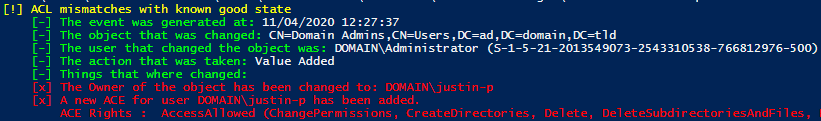

# MonitorACEChanges

**Note: please test this in a test environment before applying this in production. This should be considered as Proof of Concept code.**

Due the lack of public examples on how to monitor for ACE changes in AD I created these 2 PoC's. There are probally ways to monitor this that work/scale better (for example a SIEM), but this is mainly to show that if you know where to look you can collect enough data to monitor for ACE changes.

## Example 1: Get current SDDLs

`GetKnownGoods.ps1` will collect SDDL's of all the current AD Objects. This example then exports these values to a XML file.  
This process could be implemented to run on a schedule to collect this data over time. Another process could be implemented that compares these results to detect malicious activity.

## Example 2: Use EventID 5136 and known 'good' SDDL values to detect changes in ACE's.

After configuring `Audit Directory Services Changes` and a SACL whenever a change to a ACE of a AD Object is made a Event with EventID 5136 is logged. `MonitorEvents.ps1` uses the data collected by previous example `GetKnownGoods.ps1` as known good values. It then compares these values against triggered events to determine what changed from the previously known 'good' state.

*With known good states*  

*Without known good states*

### Prerequisites for Example 2.

1. Create a GPO and follow this guide to apply the 'Baseline Recommendation' at minimum.  
https://docs.microsoft.com/en-us/windows-server/identity/ad-ds/plan/security-best-practices/audit-policy-recommendations

2. Create a second GPO to enforce Advanced Auditing.  
https://docs.microsoft.com/en-us/windows-server/identity/ad-ds/plan/security-best-practices/Monitoring-Active-Directory-for-Signs-of-Compromise#enforcing-traditional-auditing-or-advanced-auditing

3. Apply a SACL on the root of AD that monitors changes made to properties and permissions.  

4. Apply GPO's to the Domain Controllers OU and reboot them.  

5. Run `GetKnownGoods.ps1`. Make sure to update the paths for Export-CliXML and Import-CliXML.
